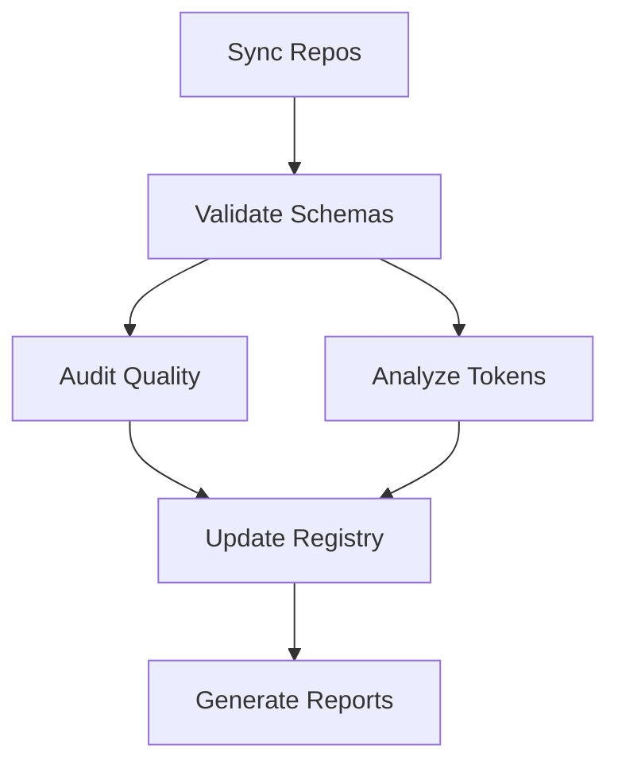

# Marketplace Build System

**Comprehensive CI/CD pipeline for maintaining gICM marketplace quality.**

---

## Overview

The marketplace build system automates quality control across 4 critical dimensions:

1. **Repository Sync** - Fetch latest community content
2. **Schema Validation** - Ensure Skills v2 compliance
3. **Quality Audit** - Score items across 5 dimensions
4. **Token Optimization** - Reduce API costs via progressive disclosure

---

## Quick Start

### Run Locally

```bash
# Sync community repositories
npm run marketplace:sync

# Validate skill schemas
npm run marketplace:validate

# Audit marketplace quality
npm run marketplace:audit

# Analyze token usage
npm run marketplace:tokens

# Run all scripts (full pipeline)
npm run marketplace:all
```

### Typical Output

```
🔄 Repository Sync: 3 repos synced, 12 changes detected
✅ Schema Validation: 20/23 skills valid (87.0%)
📊 Quality Audit: Average score 74.3/100
💰 Token Analysis: 22% potential savings ($7.88/month)
```

---

## Architecture

### Script Flow



### File Structure

```
gICM/
├── scripts/
│   ├── sync-community-repos.ts      # Repository sync
│   ├── validate-skills-schema.ts    # Schema validation
│   ├── audit-marketplace.ts         # Quality audit
│   └── generate-progressive-disclosure.ts  # Token analysis
├── .github/workflows/
│   └── marketplace-quality.yml      # GitHub Actions workflow
├── .cache/
│   ├── repos/                       # Cached git repos
│   ├── sync-log.json               # Sync metadata
│   ├── validation-report.json      # Validation results
│   ├── audit-report.json           # Quality scores
│   └── token-analysis.json         # Token usage data
└── public/marketplace/
    └── registry.json               # Marketplace registry (updated)
```

---

## Script Details

### 1. Repository Sync

**Purpose:** Keep marketplace content up-to-date with community repos.

**Process:**

1. Clone/pull from configured repositories
2. Detect file changes (new, modified, deleted)
3. Track commit hashes for versioning
4. Generate sync report with timestamps

**Configuration:**

```typescript
const REPOS = [
  {
    name: "Anthropic Official Skills",
    owner: "anthropics",
    repo: "skills",
    branch: "main",
    path: ".cache/repos/anthropic-skills",
  },
  // Add more repos...
];
```

**Key Features:**

- Incremental sync (only fetch changes)
- Shallow clones for speed (--depth 1)
- Error handling with retry logic
- Detailed change tracking

---

### 2. Schema Validation

**Purpose:** Ensure all skills comply with Agent Skills v2 specification.

**Validation Rules:**

- **Skill ID:** Lowercase, alphanumeric, hyphens only
- **Name:** Max 64 chars, no reserved words
- **Description:** Max 1024 chars
- **Version:** Semver format (1.0.0)
- **Token Budgets:** Level 1 <200, Level 2 <5000

**Reserved Words:** `anthropic`, `claude`, `official`

**Output Format:**

```json
{
  "totalFiles": 23,
  "validFiles": 20,
  "invalidFiles": 3,
  "errors": 5,
  "warnings": 2,
  "files": [
    {
      "file": "trading-bot.md",
      "valid": false,
      "issues": [
        {
          "severity": "error",
          "field": "level1.metadata.name",
          "message": "Name exceeds 64 characters",
          "suggestion": "Shorten name to 64 chars or less"
        }
      ]
    }
  ]
}
```

---

### 3. Quality Audit

**Purpose:** Score marketplace items across 5 quality dimensions.

**Scoring Model:**

| Dimension     | Weight | Criteria                            |
| ------------- | ------ | ----------------------------------- |
| Documentation | 20%    | Completeness, examples, setup guide |
| Code Quality  | 25%    | Versioning, dependencies, changelog |
| Community     | 15%    | Installs, remixes, popularity       |
| Maintenance   | 15%    | Recent updates, active development  |
| Security      | 25%    | Env handling, sandboxing, deps      |

**Status Thresholds:**

- **VERIFIED** (80+): Production-ready
- **NEEDS_FIX** (60-79): Good but improvable
- **FLAGGED** (<60): Quality issues

**Quality Checks:**

- Missing documentation → High severity
- No version → Medium severity
- Network without sandbox → Critical severity
- Unmaintained (no updates) → Medium severity

**Output:**
Updates `registry.json` with audit metadata:

```json
{
  "audit": {
    "lastAudited": "2025-12-11T10:30:00.000Z",
    "qualityScore": 85,
    "status": "VERIFIED",
    "issues": []
  }
}
```

---

### 4. Token Analysis

**Purpose:** Optimize token usage to reduce Claude API costs.

**Token Budget Model:**

- **Level 1 (Metadata):** <200 tokens - Always loaded
- **Level 2 (Instructions):** <5000 tokens - Loaded on match
- **Level 3 (Resources):** Unlimited - Loaded on demand

**Analysis Process:**

1. Estimate current token usage per level
2. Identify optimizations (extract to Level 3)
3. Calculate potential savings
4. Generate actionable recommendations

**Example Recommendations:**

- "Reduce Level 2 by 3300 tokens - extract examples to Level 3"
- "Long description verbose - summarize, link to docs"
- "Add progressiveDisclosure config for optimal management"

**Cost Savings Calculation:**

```typescript
const savedTokens = currentTokens - recommendedTokens;
const costPerMToken = 3; // $3 per 1M tokens (Claude Sonnet)
const monthlySavings = (savedTokens / 1_000_000) * costPerMToken * 30;
```

---

## GitHub Actions Workflow

### Trigger Events

1. **Schedule:** Daily at midnight UTC
2. **Workflow Dispatch:** Manual trigger
3. **Pull Request:** On marketplace file changes

### Jobs

#### 1. `sync-repos`

- Syncs community repositories
- Uploads sync report as artifact
- Timeout: 15 minutes

#### 2. `validate-schemas`

- Validates skill schemas
- Posts PR comment on failures
- Timeout: 10 minutes

#### 3. `audit-quality`

- Runs quality audit
- Checks quality thresholds
- Fails if >20% flagged or avg <70
- Timeout: 10 minutes

#### 4. `analyze-tokens`

- Analyzes token usage
- Generates optimization guide
- Timeout: 10 minutes

#### 5. `update-registry`

- Updates registry.json with audit data
- Commits changes (scheduled runs only)
- Skips CI with [skip ci]
- Timeout: 5 minutes

#### 6. `notify-results`

- Aggregates workflow status
- Optional Slack/Discord notification
- Always runs

---

## Performance Metrics

### Execution Times (Typical)

| Script    | Duration   | Bottleneck       |
| --------- | ---------- | ---------------- |
| Sync      | 8-12s      | Git clone/pull   |
| Validate  | 3-5s       | File parsing     |
| Audit     | 4-6s       | Scoring logic    |
| Tokens    | 4-6s       | Token estimation |
| **Total** | **30-60s** | I/O operations   |

### Optimization Strategies

**Caching:**

- Git repos cached locally (incremental pulls)
- npm packages cached by GitHub Actions
- Sync log tracks last sync timestamp

**Parallelization:**

- Audit and token analysis run concurrently
- Multiple skill files validated in parallel
- Independent GitHub Actions jobs

**Incremental Processing:**

- Only sync changed files
- Skip validation for unchanged skills
- Delta updates to registry.json

---

## Best Practices

### Daily Operations

**Morning Routine:**

```bash
# Check overnight quality pipeline
gh run list --workflow=marketplace-quality.yml --limit 1

# Review flagged items
npm run marketplace:audit | grep "FLAGGED"

# Check token optimization opportunities
npm run marketplace:tokens | grep "Critical"
```

**Pre-deployment Checklist:**

```bash
npm run marketplace:validate  # Must pass
npm run marketplace:audit     # Score >70
npm run marketplace:tokens    # No critical issues
```

### Monitoring

**Key Metrics to Track:**

- Validation success rate (target: >90%)
- Average quality score (target: >75)
- Token efficiency (target: <5000 avg/skill)
- Sync failures (target: 0%)

**Alert Thresholds:**

- CRITICAL: >20% items flagged
- WARNING: Average score <70
- INFO: New sync available

### Maintenance

**Weekly:**

- Review audit trends
- Update quality weights if needed
- Check for deprecated items

**Monthly:**

- Audit community repo access
- Update token estimation constants
- Review and archive old reports

**Quarterly:**

- Evaluate scoring model effectiveness
- Update schema validation rules
- Benchmark against marketplace growth

---

## Troubleshooting

### Common Issues

**"Registry not found"**

```bash
mkdir -p public/marketplace
echo "[]" > public/marketplace/registry.json
```

**Git clone fails**

```bash
# Check network
ping github.com

# Verify repo access
git ls-remote https://github.com/anthropics/skills.git
```

**TypeScript errors**

```bash
npm install -D typescript ts-node @types/node
```

**GitHub Actions timeout**

```yaml
# Increase timeout in workflow
timeout-minutes: 20 # Default: 10
```

### Debug Mode

**Enable verbose logging:**

```bash
DEBUG=* npm run marketplace:sync
```

**Dry run (no changes):**

```bash
DRY_RUN=1 npm run marketplace:audit
```

**Skip cache:**

```bash
rm -rf .cache && npm run marketplace:all
```

---

## Advanced Configuration

### Custom Quality Weights

Adjust scoring emphasis in `audit-marketplace.ts`:

```typescript
const WEIGHTS = {
  documentation: 0.3, // Prioritize docs (was 0.20)
  codeQuality: 0.25,
  community: 0.1, // Reduce community weight
  maintenance: 0.15,
  security: 0.2, // Reduce security weight
};
```

### Custom Token Limits

Modify token budgets in `generate-progressive-disclosure.ts`:

```typescript
const LEVEL1_MAX_TOKENS = 150; // Stricter metadata limit
const LEVEL2_MAX_TOKENS = 3000; // Reduce instruction limit
```

### Add New Repositories

Extend sync sources in `sync-community-repos.ts`:

```typescript
const REPOS = [
  // ... existing repos
  {
    name: "Your Custom Repo",
    owner: "your-username",
    repo: "your-repo",
    branch: "main",
    path: ".cache/repos/custom",
  },
];
```

---

## API Reference

### TypeScript Exports

All scripts export main functions and types:

```typescript
// Sync
import { syncAllRepos } from "./scripts/sync-community-repos";
const report = await syncAllRepos();

// Validate
import { validateAllSkills } from "./scripts/validate-skills-schema";
const validation = await validateAllSkills();

// Audit
import { auditMarketplace } from "./scripts/audit-marketplace";
const audit = await auditMarketplace();

// Tokens
import { generateTokenReport } from "./scripts/generate-progressive-disclosure";
const tokens = await generateTokenReport();
```

### Report Types

```typescript
interface SyncReport {
  timestamp: string;
  totalRepos: number;
  successfulSyncs: number;
  totalChanges: number;
  results: SyncResult[];
}

interface ValidationReport {
  timestamp: string;
  totalFiles: number;
  validFiles: number;
  errors: number;
  files: FileValidation[];
}

interface AuditReport {
  timestamp: string;
  totalItems: number;
  averageScore: number;
  verified: number;
  needsFix: number;
  flagged: number;
  audits: ItemAudit[];
}

interface TokenReport {
  timestamp: string;
  totalSkills: number;
  averageTokensPerSkill: number;
  potentialSavings: number;
  skills: SkillTokenAnalysis[];
}
```

---

## Roadmap

### Q1 2025

- [ ] Automated PR creation for quality fixes
- [ ] Slack/Discord webhook notifications
- [ ] Historical trend analysis dashboard
- [ ] Performance benchmarking suite

### Q2 2025

- [ ] ML-based quality prediction
- [ ] Automated token optimization suggestions
- [ ] Integration with marketplace search ranking
- [ ] Real-time validation API endpoint

### Q3 2025

- [ ] Cross-platform compatibility checker
- [ ] Community contribution scoring
- [ ] Automated deprecation detection
- [ ] A/B testing framework for quality rules

---

## Contributing

Contributions welcome! See `scripts/README.md` for implementation guidelines.

**Key Areas:**

- New validation rules
- Additional quality dimensions
- Performance optimizations
- Enhanced reporting

---

## Support

- **Issues:** https://github.com/0motionguy/gICM/issues
- **Docs:** https://gicm.app/docs/build-system
- **Discord:** https://discord.gg/gicm

---

**Version:** 1.0.0
**Last Updated:** 2025-12-11
**Maintainer:** Mirko Basil Dölger (@0motionguy)
